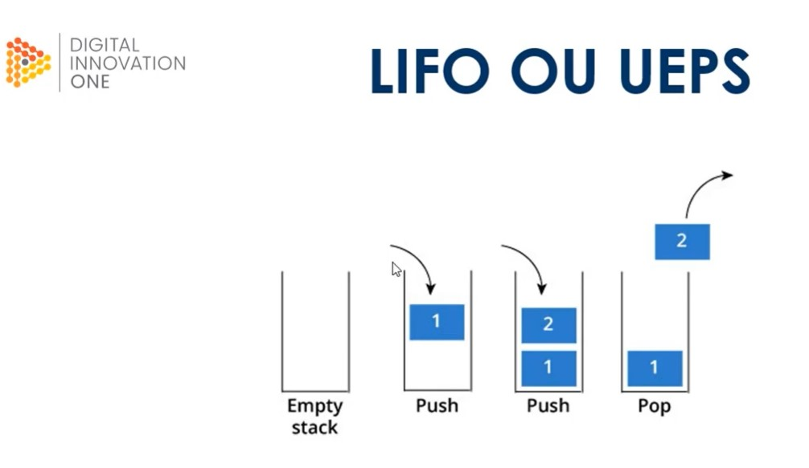
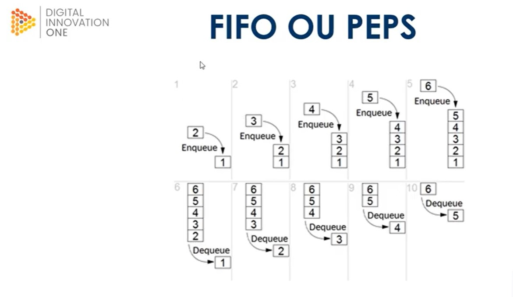

# Algoritmos

É uma sequencia de passos lógicos para resolver uma tarefa ou operação específica.

Os algoritmos são usados para manipular dados nas estruturas de várias formas, como por exemplo: inserir, excluir, procurar e ordenar dados.

# Estrutura de Dados 

Estrutura de dados é uma estrutura organizada de dados na memória de um computador ou em qualquer dispositivo de armazenamento , de forma que os dados possam ser utilizados de forma correta.

Em uma estrutura de dados devemos saber como realizar um determinado conjunto de operações básicas, como por exemplo:
- Inserir dados;
- Excluir dados;
- Localizar um elemento;
- Percorrer todos os itens constituintes da estrutura para visualização;
- Classificar, que se resume em colocar os itens de dados em uma ordem alfabética, númerica e etc;

## Principais estruturas de dados utilizadas em algoritmo, são:
- Vetores e Matrizes;
- Registro;
- Lista;
- Pilha;
- Fila;
- Arvore;
- Tabela Hash;
- Grafos;

__Vetores e Matrizes__:  São chamados também de arrays. O array é uma estrutura de dados que armazena um a mais valores, por exemplo sua sintaxe  em Javascript _let array = ["pera", "uva", "abacaxi", "caju"....]_. Para acessá-los, podemos realizar alguns métodos que percorrem o array ou até mesmo usando seu indice array[0] = "pera";

__Registro__: É uma estrutura que fornece um formato especializado para armazenar informações em mémoria. Um registro é composto por campos que especificam cada uma das informações que o compõem.

__Listas__: Armazena dados de um determinado tipo em uma ordem especifica.
A diferença entre listas e arrays é que as listas possuem um tamanho ajustável, enquanto arrays possuem tamanho fixo.

Existem dois tipos de listas:
- _Ligadas_: neste tipo existem nós onde cada um dos nós conhece o valor que está sendo armazenado em seu interior além de conhecer o elemento posterior a ele: por isso ela é chamada de 'lista ligada', pois os nós são amarrados com essa indicação de qual é o próximo nó.
- _Duplamente Ligadas_: a grande diferença das listas duplamente ligadas para as listas ligadas é que elas são bidirecionais. Não conseguimos "andar para trás" em listas ligadas, pois os nós de uma lista ligada sabem somente que é o proximo elemento.

__Pilhas__: é uma estrutura de dados que serve como uma coleção de elementos, e permite o acesso a somente um item de dados armazenados. O acesso aos itens de uma pilha é restrito - somente um item pode ser lido ou removido por vez.

Tipos de Pilhas: 
- LIFO ou UEPS: o último que entra é o primeiro a sair;
- FIFO ou PEPS; o primeiro que entra é o primeiro a sair

__Filas__: Esta estrutura admite remoção de elementos e inserção de novos sujeita à seguinte regra de operação: o primeiro elemento que entrou e está há mais tempo será o primeiro a ser removido, segue o conceito PEPS.

__Arvores__: É uma estrutura de dados que organiza seus elementos de forma hierarquica , onde existe um elemento que fica no topo da arvore, chamado raiz e existem os elementos subordinados a ele, que são chamados de nós ou folhas.

__Tabela Hash__: Uma tabela hash, de dispersão ou espalhamento é uma estrutura de dados especial , que associa chaves de pesquisa a valores.